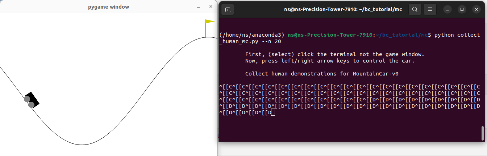

### Mountain Car
Continuous state and <b>discrete</b> action.

#### installation
```bash
pip install gym==0.26.2
pip install readchar
``` 


### Collecting human demonstration using keyboard



Skip this step if you want to use the provided expert data. Run the following command to collect your own human demonstration. 

``` 
python collect_human_mc.py --n 10
```
Data will be saved in `expert_data` folder. 


### Train policy
* <a href="bc_mc_sklearn.ipynb"> Scikit-learn jupyter notebook </a> <br>

* <a href="bc_mc_torch.ipynb"> Pytorch jupyter notebook </a>


