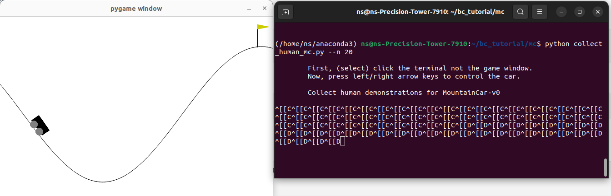

### Imitation Learning Hello World


### Collecting human demonstration using MC environment

```bash
pip install gym==0.26.2
pip install readchar
``` 




### Mountain Car
Continuous state and discrete action.

* Step 1: Data Collection (Human Expert)
``` 
python collect_human_mc.py --n 10
```

* Step 2: Train the model & Evaluate
```
# Scikit-learn Model
bc_mc_sklearn.ipynb

# Pytorch Model
bc_mc_torch.ipynb
```

### Pendulum
Both state and action are continuous.

* Step 1: Data Collection (RL demonstration)
```
TODO: RL policy, expert data in expert_data/
```

* Step 2: Train the model & Evaluate
```
# Scikit-learn Model
bc_pendulum_sklearn.ipynb

# Pytorch Model with MSE loss
bc_pendulum_torch.ipynb

# Pytorch Model (Gaussian Actor) with MLE loss
bc_pendulum_torch_gaussian.ipynb
```


### MuJoCo Tasks {Ant, HalfCheetah, Hopper, Humanoid, Walker2d}
Both state and action are continuous.

