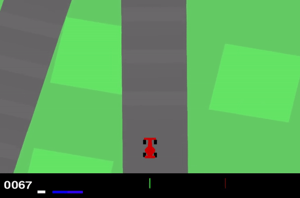
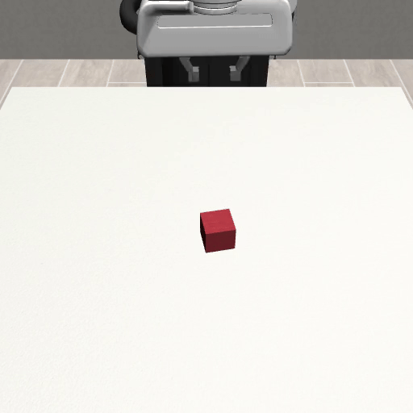

### Imitation Learning Hello World (dev in progress)

Imitation learning is supervised learning where data comes as expert demonstration. The expert can be a human or any other agent. Input data is referred to as "state" and output data as "action." In discrete action spaces, it resembles classification; in continuous action spaces, it is regression.

Policy $\pi: S \rightarrow A$ is the function/model that takes a state as input and outputs an action. The goal of imitation learning is to learn a policy that mimics the expert's behavior.

Behavioral Cloning (BC) is offline imitation learning that use only the collected demonstrations and doesn't use simulator during learning. 

* This tutorial is educational purpose, so code isn't optimized for production but easy to understand. 
* Each policy training is done in a single jupyter notebook.
* Each directory contain a readme file.


We will walk through following experiments. 
|  Env   |   Task       |  State Space |  Action Space  |  Expert  |  Colab  |
|--------|--------------|--------------|----------------|----------|---------|
| Gym    | Mountain Car | Continuous(2)   | Discrete(3)       | Human    | toadd |
| Gym    | Pendulum     | Continuous(3)   | Continuous(1)     | RL       | toadd |
| Gym    | Car Racing   | Image(96x96x3)   | Continuous(3)     | Human    | toadd  |
| MuJoCo | Ant          | Continuous(111)   | Continuous(8)     | RL       | toadd   |
| Robomimic | Lift      | Low-dim(19)   | Continuous(7)     | Human    | toadd   |


<!-- | MuJoCo | HalfCheetah  | Continuous(17)   | Continuous(6)     | RL       | train   | -->
<!-- | MuJoCo | Humanoid  | Continuous(376)   | Continuous(17)     | RL       | train   | -->
<!-- | Sawyer | Block        | Image,Low-dim   | Continuous     | Human    | train   | -->  

### Data format
* We will use hdf5 file for robomimic (see the 'readme.md' in robomimic directory to understand the data format) and real robot.
* For rest of the environment we will store as *.pkl file with the following structure.

*.pkl structure we are going to use.

### Installation
```bash
    pip install gym==0.26.2
    pip install readchar
    pip install imageio
    pip install -U scikit-learn
```
* Install PyTorch https://pytorch.org/get-started/locally/

### Demos

<div style="display: grid; grid-template-columns: repeat(2, 1fr); gap: 1px;">
    <figure>
        
        <figcaption>CarRacing-v2</figcaption>
    </figure>
    <figure>
        
        <figcaption>Ant</figcaption>
    </figure>
    <figure>
         
        <figcaption>Robosuite Lift</figcaption>
    </figure>
</div>


