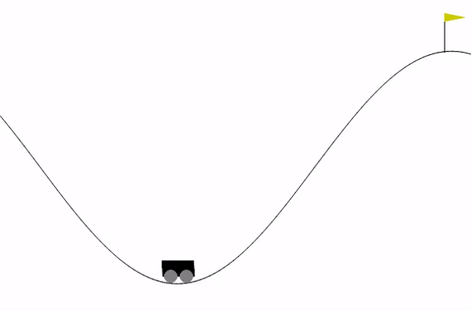
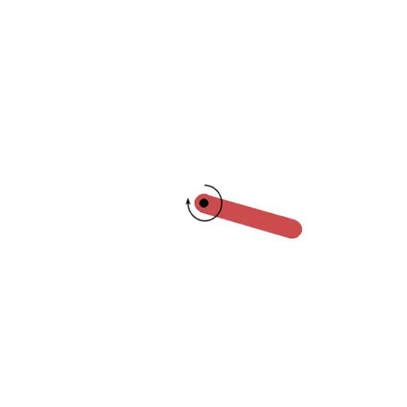

### Hello World in Imitation Learning 

Imitation learning is supervised learning where data comes as expert demonstration. The expert can be a human or any other agent. Input data is referred to as "state" and output data as "action." In discrete action spaces, it resembles classification; in continuous action spaces, it is regression.

Policy $\pi: S \rightarrow A$ is the function/model that takes a state as input and outputs an action. The goal of imitation learning is to learn a policy that mimics the expert's behavior.

Behavioral Cloning (BC) is offline imitation learning that use only the collected demonstrations and doesn't use simulator during learning. 

* This tutorial is educational purpose, so code isn't optimized for production but easy to understand. 
* Each policy training is done in a single jupyter notebook.
* Each directory contains a readme file.

 
<!-- ### Installation
```bash
    pip install gym==0.26.2
    pip install readchar
    pip install imageio
    pip install -U scikit-learn
```
* Install PyTorch https://pytorch.org/get-started/locally/ -->

### Demos
 
| Video | Task | State Space | Action Space | Expert | Colab |
|--------|------|-------------|--------------|--------|-------|
|  | [MountainCar-v0](mountain_car) | Continuous(2) | Discrete(3) | Human | [Open In Colab](https://colab.research.google.com/github/AssistiveRoboticsUNH/bc_tutorial/blob/main/mountain_car/bc_mc_torch.ipynb) |
|  | [Pendulum-v1](pendulum) | Continuous(3) | Continuous(1) | RL | [Open In Colab](https://colab.research.google.com/github/AssistiveRoboticsUNH/bc_tutorial/blob/main/pendulum/bc_pendulum_torch.ipynb) |
|  | [CarRacing-v2](car_racing) | Image(96x96x3) | Continuous(3) | Human | [Open In Colab](https://colab.research.google.com/github/AssistiveRoboticsUNH/bc_tutorial/blob/main/car_racing/bc_carracing.ipynb) |
|  | [Ant-v3](mujoco) | Continuous(111) | Continuous(8) | RL | toadd |
|  | [Lift](robomimic_tasks) | Low-dim(19) | Continuous(7) | Human | toadd |

### Quick start
* use the "Open In Colab" links above to run the code in colab.

### Install locally to collect data on your own
* please see the readme file in each directory for installation and data collection instructions.


### Data format
* We use hdf5 file for robomimic (see the 'readme.md' in robomimic directory to understand the data format) and real robot.
* For rest of the environment we store as *.pkl file.

